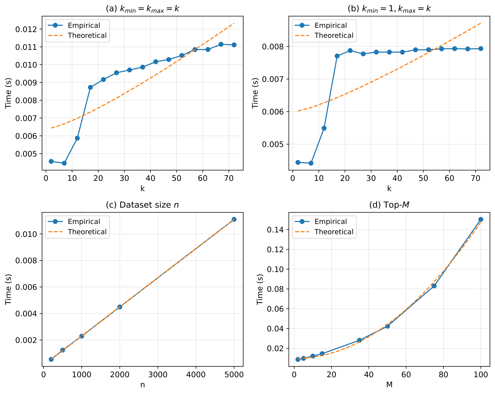

.. _performance:

Performance
===========

FOSC-X is designed to efficiently extract high-quality clusterings from
hierarchical structures. In practice, it scales well with tree size and
supports fast exploration of multiple candidate solutions.

Scaling Behaviour
-----------------

The runtime of FOSC-X is primarily determined by the size of the hierarchy
(i.e. the number of nodes) and the choice of quality measure.

In practice:

- Runtime scales approximately linearly with the number of nodes  
- Dependence on ``kmax`` is typically weak (near constant or sublinear)  
- Computing multiple candidate solutions (``top_M``) scales quadratically  
  (however, ``top_M`` is typically small in practice)

The figure below illustrates empirical scaling behaviour across different
settings.

Quality Measures
----------------

The choice of quality measure has a significant impact on performance:

- ``"Stability"``  
  Fast and lightweight (tree-based)

- ``"Modularity"``  
  More computationally expensive due to k-nearest neighbor graph construction  

- ``"PFCE"``  
  More computationally intensive than ``"Stability"`` and ``"Modularity"``, based on the minimum
  spanning tree  

In general, ``"Stability"`` is the most efficient option and may be recommended
for larger datasets.

Numba Compilation
-----------------

FOSC-X can optionally use `Numba <https://numba.pydata.org/>`_ to accelerate
core computations. If Numba is installed, FOSC-X will use it by default.

On first execution, Numba-accelerated functions may be compiled, which can
introduce a noticeable one-time overhead. The exact cost depends on the
environment and workload, but typically takes a few seconds to complete.

Once compiled, the generated code is cached and reused, making subsequent
runs significantly faster. In most cases, the actual computation time on
datasets is on the order of fractions of a second.

.. note::

   Compilation overhead is typically incurred only once per installation
   or environment. If the package remains installed and the environment
   does not change, recompilation is generally not required.

Numba can be disabled after importing :mod:`foscx`, but **before**
:class:`foscx.FOSCX` is loaded.

For example:

.. code-block:: python

   import foscx

   foscx.set_numba_enabled(False)

   model = foscx.FOSCX(...)

.. note::

   The Numba setting must be configured before ``FOSCX`` is imported or
   instantiated. For example, the following will load ``FOSCX`` immediately
   and therefore bypass the configuration step:

.. code-block:: python

   from foscx import FOSCX

If Numba is not installed, FOSC-X automatically falls back to a pure Python
implementation and no additional configuration is required.

.. note::

   The Numba setting only affects FOSC-X and does not modify Numba behavior
   for other installed packages.

Effect of Condensation
----------------------

Applying tree condensation (``min_cluster_size > 1``) reduces the size of the
hierarchy by removing small clusters.

This can improve performance by reducing the number of nodes that must be
evaluated, although the removed nodes are typically small and inexpensive to
process.

Theoretical Complexity
----------------------

In the worst case, the dynamic programming procedure has complexity:

.. math::

    O(N \cdot M^2 \cdot k_{\max} \cdot \log(M \cdot k_{\max}))

where:

- ``N`` is the number of nodes in the hierarchy  
- ``M`` is the number of candidate solutions (``top_M``)  

In practice, the algorithm behaves much closer to linear in ``N``, with only
weak dependence on ``kmax``.