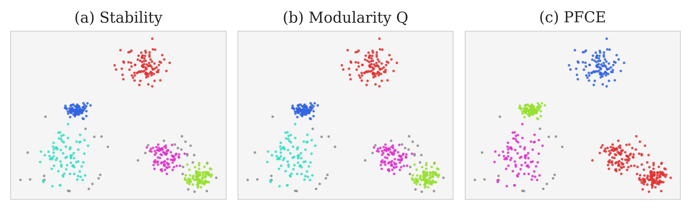
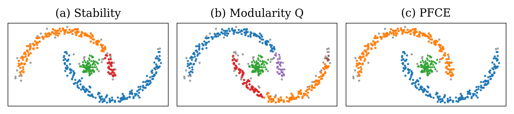
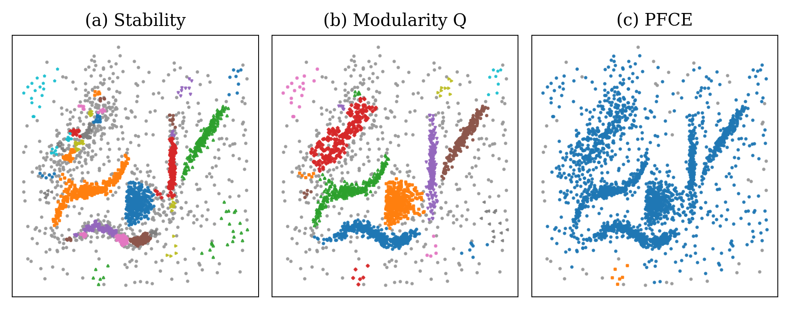

.. _quality_measures:

Quality Measures
================

FOSC-X selects clusterings by optimising a *quality measure* defined over the
cluster tree. Different measures capture different notions of what constitutes
a "good" clustering.

FOSC-X currently supports three unsupervised quality measures, and two semi-supervised quality measures.
The supported unsupervised measures are:

- ``Stability / Excess of Mass`` ([1]_, [2]_, [3]_) (default)
- ``Modularity Q`` [4]_
- ``PFCE`` [5]_

The supported semi-supervised measures are:

- ``Semi-Supervised B³ (BCubed)`` [6]_
- ``Constraint Satisfaction (constraints)`` [1]_

Each measure evaluates clusters independently and assigns a score, which is then
summed across the selected clusters.

Unsupervised Quality Measures
-----------------------------

The three quality measures differ primarily in how they evaluate clusters:

- ``Stability`` is derived from the structure of the cluster tree  
- ``Modularity Q`` is computed from a similarity graph constructed from the data  
- ``PFCE`` is computed from the minimum spanning tree (MST) associated with the cluster tree  

As a result, they may produce different clusterings when the tree structure and
data geometry do not fully align.

Stability
---------

Stability is derived directly from thestructure of the cluster tree.
In density-based hierarchies (e.g. HDBSCAN), Exess of Mass (EOM) corresponds to a density-based
formulation of stability, where cluster persistence is measured across density
levels.

Stability measures how long a cluster persists across the hierarchy. Clusters
that exist over a wide range of resolutions receive higher scores.

Key properties:

- Uses only the tree structure (no raw data required)  
- Computed from cluster lifetimes in the hierarchy  
- Computationally efficient and lightweight  
- Sensitive to structural changes in the tree  

Stability can be influenced by small or short-lived splits in the hierarchy.
Applying tree condensation (``min_cluster_size``) can help remove low-support
branches and produce more continuous cluster lifetimes.

Stability is undefined for noise observations and as such they do not contribute to the quality score.

Modularity Q
------------

Modularity Q is a graph-based cluster quality measure that evaluates how well
clusters are internally connected compared to a null model.

It constructs a similarity graph from the data and assigns higher scores to
clusters with strong internal connectivity and weaker connections to other
clusters. Unlike tree-based measures, Modularity Q is computed independently of
the hierarchical structure and instead relies on a k-nearest neighbor (k-NN)
graph.

Key properties:

- Builds a k-nearest neighbor (k-NN) graph from the input data or uses a
  precomputed graph
- Evaluates cluster quality based on graph connectivity
- Depends on the choice of ``nearest_neighbors`` and distance ``metric``
- Independent of the hierarchical clustering tree

Example usage:

.. code-block:: python

    model = FOSCX(
        quality_measure="Modularity",
        nearest_neighbors=10,
        metric="euclidean"
    )
    model.fit(Z, y=X)

Notes:

- ``nearest_neighbors`` controls graph construction and defaults to
  ``min_cluster_size`` when available (e.g. HDBSCAN)

- ``metric`` defines how distances are computed when constructing the k-NN
  graph. It should match the metric used to build the hierarchy when applicable.
  Supported metrics are those accepted by
  ``sklearn.neighbors.NearestNeighbors``.

- If ``metric="precomputed"``, ``y`` is interpreted as a **precomputed distance
  matrix**, and nearest neighbors are computed directly from this matrix using
  ``sklearn.neighbors.NearestNeighbors``.

- If ``metric="precomputed_similarity"``, ``y`` is interpreted as a
  **precomputed similarity graph**, which is used directly without constructing
  a k-NN graph.

- May assign small or negative scores to weakly connected clusters or noise. Assigning score to noise may be preventable with ``keep_noise_quality=False`` which instead assigns noise a quality score of zero. 

Precomputed similarity graph example:

.. code-block:: python

    G = precomputed_similarity_graph(X)

    model = FOSCX(
        quality_measure="Modularity",
        metric="precomputed_similarity"
    )
    model.fit(Z, y=G)

PFCE
----

PFCE (Partition-Free Cluster Evaluation) is a graph-based quality measure defined
on the minimum spanning tree (MST) associated with the hierarchy.

It evaluates clusters using connectivity information derived from the MST,
capturing aspects of cluster cohesion and separation.

Key properties:

- Only available for HDBSCAN-based hierarchies  
- Uses the minimum spanning tree  
- Computed independently of the hierarchical tree structure  
- Incorporates notions of sparseness, separation, and dividedness  

Example usage:

.. code-block:: python

    model = FOSCX(quality_measure="PFCE")
    model.fit(hdbscan_clusterer)

Notes:

- Requires an HDBSCAN object with MST available
  (e.g. ``hdbscan.HDBSCAN(gen_min_span_tree=True)``)  
- Not supported for sklearn HDBSCAN 
- Noise observations are assigned a PFCE quality score of zero, and as such do not contribute to the overall quality score.

Examples
--------

The following examples illustrate how different quality measures can produce
different clusterings depending on the structure of the data.

Example 1: Well-separated clusters
~~~~~~~~~~~~~~~~~~~~~~~~~~~~~~~~~~~

A dataset consisting of well-separated Gaussian clusters.

In this setting, the hierarchical structure closely matches the underlying data
distribution. As a result, all quality measures tend to produce similar
clusterings.

Example 2: Non-Convex Clusters
~~~~~~~~~~~~~~~~~~~~~~~~~~~~~~~~~~~~~~~~~~~~~~~~~

A dataset consisting of two non-convex (curved) clusters, along with a smaller
dense cluster embedded within one region and a small amount of noise.

This structure is clearly defined, but is not well represented by simple convex
cluster boundaries. As a result, the hierarchy may introduce additional splits
within the curved regions.

In this example:

- Stability and Modularity produce similar clusterings, with some fragmentation
  of the non-convex structures  
- PFCE identifies the full curved structures without fragmentation  

Example 3: Density-based structure with noise
~~~~~~~~~~~~~~~~~~~~~~~~~~~~~~~~~~~~~~~~~~~~~

A dataset with varying density, non-convex clusters, and noise points.

In this case, the hierarchical structure reflects density variations and
irregular cluster shapes. Noise and low-density regions introduce additional
flexibility, and different measures may emphasise different aspects of the
structure.

In this example:

- Stability identifies most of the underlying cluster structure, but fragments
  some clusters and selects a small number of noise points as clusters.
- Modularity identifies the cluster structure with minimal fragmentation, 
  but also selects some noise as clusters. 
- PFCE fails to identify any clustering structure.

Semi-Supervised Quality Measures
--------------------------------

FOSCX provides two semi-supervised quality measures which differ primarily in the type of supervision they use.

**Semi-Supervised B³** evaluates candidate clusters using partially available class labels. Only observations with known labels contribute to the quality calculation, allowing clustering performance to be assessed even when supervision is sparse.

**Constraint Satisfaction** evaluates candidate clusters using pairwise supervision in the form of must-link and cannot-link constraints. Must-link constraints indicate that two observations should belong to the same cluster, while cannot-link constraints indicate that they should belong to different clusters.

The constraint-based method can operate directly on explicit pairwise constraints, but may also derive constraints automatically from labels when labels are provided. For example:

- observations with the same label generate must-link constraints
- observations with different labels generate cannot-link constraints

Semi-supervised quality measures additionally require a tie-breaking measure, as quality scores may be non-unique, particularly when supervision is sparse or only a small proportion of observations are labeled.

By default, FOSC-X uses ``Stability`` as the tie-breaking measure. This behavior can be modified using the ``tie_quality`` parameter to specify an alternative unsupervised quality measure.

Semi-Supervised B³
-------------------

The semi-supervised ``B³`` quality measure extends the standard ``B³`` (BCubed) clustering validation metric to settings with partially labeled data. Rather than requiring labels for all observations, only the labeled subset contributes to the quality calculation.

For each labeled observation, the measure evaluates how well the extracted clusters preserve agreement with the provided supervision. Unlabeled observations are ignored during evaluation.

This allows users to guide cluster extraction with sparse supervision while still benefiting from hierarchical structure.

Input labels should be supplied through ``z`` as a one-dimensional array:

- observations with known labels use integer class labels
- unlabeled observations should be assigned ``-1``

Example:

.. code-block:: python

    labels = np.array([
        0, 0, 0,
        -1, -1,
        1, 1
    ])

    model = FOSCX(
        quality_measure="BCubed",
        tie_quality="Stability"
    )

    model.fit(Z, z=labels)

This formulation is particularly useful when only a small subset of observations can be annotated.

If ``keep_noise_quality=True``, noise observations are assigned BCubed quality values as though they belong to singleton clusters. If ``keep_noise_quality=False``, 
noise observations are instead assigned a quality score of 0.

Constraint Satisfaction
-----------------------

The ``constraints`` quality measure supports semi-supervised clustering through pairwise supervision in the form of must-link and cannot-link constraints.

This implementation follows the framework described in:

    *A Framework for Semi-Supervised and Unsupervised Optimal Extraction of Clusters from Hierarchies*

The method evaluates how well candidate clusters satisfy the supplied pairwise constraints:

- **Must-link:** two observations should belong to the same cluster
- **Cannot-link:** two observations should belong to different clusters

Internally, transitive closure relationships are inferred automatically:

- if ``a`` must-links with ``b`` and ``b`` with ``c``, then ``a`` and ``c`` are treated as must-link
- if ``a`` must-links with ``b`` and ``b`` cannot-links with ``c``, then ``a`` and ``c`` are also treated as cannot-link

Constraints should be supplied through ``z`` as a tupple of two arrays:

.. code-block:: python

    constraints = (
        must_link,
        cannot_link
    )

where both arrays have shape:

.. code-block:: python

    (n_constraints, 2)

Example:

.. code-block:: python

    must_link = np.array([
        [0, 1],
        [2, 3]
    ])

    cannot_link = np.array([
        [0, 5],
        [1, 7]
    ])

    constraints = (must_link, cannot_link)

    model = FOSCX(
        quality_measure="constraints",
        tie_quality="Stability"
    )

    model.fit(Z, z=constraints)

If labels are available, pairwise constraints can also be generated automatically from partially labeled data durring fitting fitting.

Example:

.. code-block:: python

    labels = np.array([
        0, 0, 0,
        -1, -1,
        1, 1
    ])

    model = FOSCX(
        quality_measure="constraints",
        tie_quality="Stability"
    )

    model.fit(Z, z=labels)

Noise observations may contribute positively to the constraint satisfaction score, since assigning observations to noise can satisfy cannot-link constraints.

References
----------

.. [1] Campello, R.J.G.B., Moulavi, D., Zimek, A., and Sander, J.
       *A Framework for Semi-Supervised and Unsupervised Optimal Extraction
       of Clusters from Hierarchies.*
       Data Mining and Knowledge Discovery, 27(3), 344–371.

       DOI: https://doi.org/10.1007/s10618-013-0311-4

.. [2] Campello, R.J.G.B., and Moulavi, D., and Sander, J.
       *Density-Based Clustering Based on Hierarchical Density Estimates.*
       In: Advances in Knowledge Discovery and Data Mining,
       pp. 160–172, Springer (2013).

       DOI: https://doi.org/10.1007/978-3-642-37456-2_14

.. [3] Campello, R.J.G.B., Moulavi, D., Zimek, A., and Sander, J.
       *Hierarchical Density Estimates for Data Clustering,
       Visualization, and Outlier Detection.*
       ACM Transactions on Knowledge Discovery from Data,
       10(1), (2015).

       DOI: https://doi.org/10.1145/2733381

.. [4] Anjos, F.d.A.R., Gertrudes, J.C., Sander, J., and Campello, R.J.G.B.
       *A Modularity-Based Measure for Cluster Selection from
       Clustering Hierarchies.*
       In: Data Mining,
       pp. 253–265, Springer (2019).

       DOI: https://doi.org/10.1007/978-981-13-6661-1_20

.. [5] Thompson, J.M.
       *Partition-Free Cluster Evaluation: Extending Cluster Validation
       and Cluster Extraction from Hierarchies.*
       Master's thesis,
       University of Alberta, Edmonton, Canada (2025).

       DOI: https://doi.org/10.7939/81776

       URL:
       https://ualberta.scholaris.ca/items/7740b0c9-91dd-4517-88e8-2a57eed4899b

.. [6] Castro Gertrudes, J., Zimek, A., Sander, J., and Campello, R.J.G.B.
       *A Unified View of Density-Based Methods for Semi-Supervised
       Clustering and Classification.*
       Data Mining and Knowledge Discovery,
       33(6), 1894–1952 (2019).

       DOI: https://doi.org/10.1007/s10618-019-00651-1

