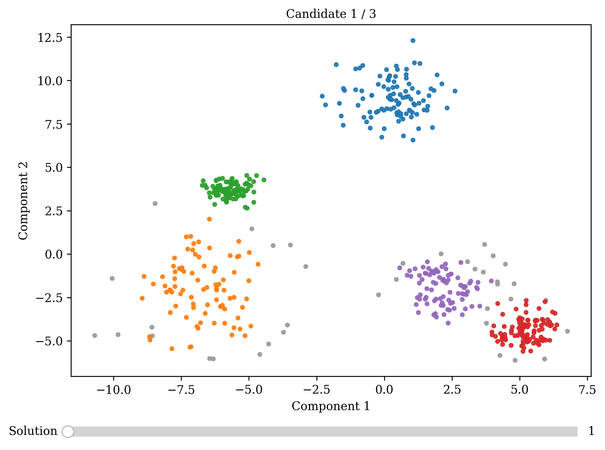
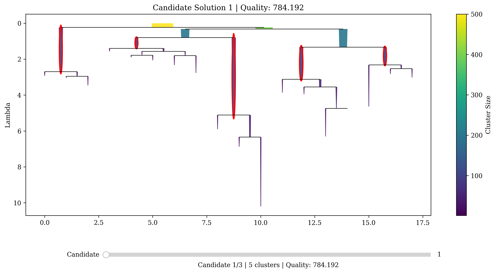

Visualization
=============

FOSC-X provides tools for visualising both cluster assignments and the
underlying hierarchical structure.

These are designed to help explore multiple candidate clusterings and
understand how they relate to the structure of the tree.

Plotting Clusterings
--------------------

The primary visualisation method is :meth:`FOSCX.plot`, which displays the
data coloured by cluster assignment.

.. code-block:: python

    model.plot()

This produces a 2D scatter plot of the data, along with an interactive
slider for switching between candidate clusterings.

In interactive environments (e.g. Jupyter notebooks or Python sessions),
the slider can be used to explore the different solutions returned by FOSC-X.

Key Parameters
~~~~~~~~~~~~~~

:meth:`FOSCX.plot` supports several useful parameters:

- ``X``  
  Data to plot. If not provided during :meth:`FOSCX.fit`, it must be supplied here.

- ``projection``  
  Dimensionality reduction method used when the data has more than two dimensions.
  Available options:

  - ``"pca"`` (default)  
  - ``"umap"``  
  - ``"none"`` (use if data is already 2D)

Example:

.. code-block:: python

    model.plot(projection="umap")

This projects the data into 2D using UMAP before plotting.

Notes
~~~~~

- Interactive sliders are available in Python environments  
- In static documentation, plots are rendered without interactivity  

Tree Visualisation
------------------

FOSC-X also provides :meth:`FOSCX.plot_tree` for visualising the hierarchical
structure directly.

.. code-block:: python

    model.plot_tree()

This displays the cluster tree, along with highlighted nodes corresponding
to each candidate clustering.

As with :meth:`FOSCX.plot`, an interactive slider allows switching between
candidate solutions and highlights the corresponding nodes in the tree.

This is particularly useful for:

- Understanding how clusterings relate to the hierarchy  
- Inspecting which branches are selected  
- Exploring alternative solutions  

Summary
-------

- Use :meth:`FOSCX.plot` to visualise cluster assignments  
- Use :meth:`FOSCX.plot_tree` to inspect the hierarchy and selected clusters  
- Use the interactive slider to explore multiple candidate solutions  

Together, these tools provide both a data-level and structure-level view
of the clustering results.